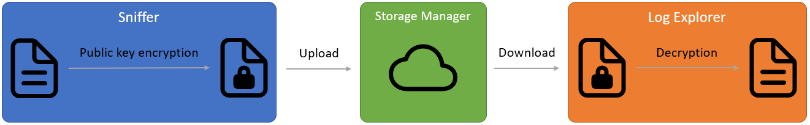
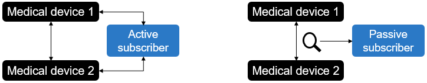
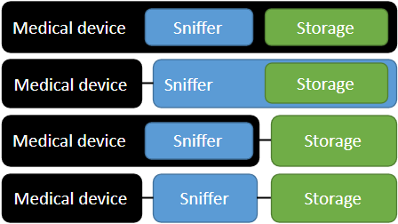
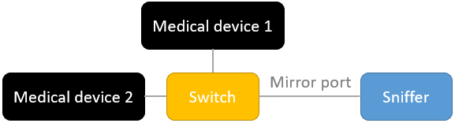
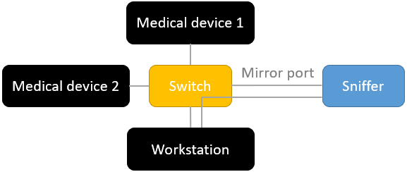
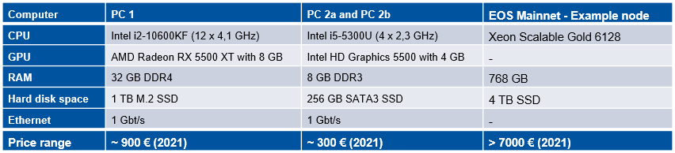
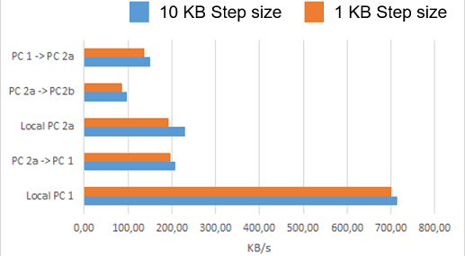

# SDC Sniffer

## Introduction
ISO/IEEE 11073 service-oriented device connectivity (SDC) is a new standard for manufacturer-independent medical device-to-device interoperability. To analyse the workflow and track errors during patient treatment, it is important to securely protect the data from tampering, deletion and access by unauthorized third parties. This project uses an eco-friendly blockchain technology and public key encryption to handle the security concerns.



The whole project **SDC Blockchain Logger** is open source and consists of three applications for different tasks:
- [**SDC Log Explorer**](https://github.com/KevinTuncer/sdc-log-explorer) to display, filter and browse through the log.
- [**SDC Sniffer**](https://github.com/KevinTuncer/sdc-sniffer) to sniff SDC messages between medical devices. 
- [**SDC Data Safe**](https://github.com/KevinTuncer/sdc-data-safe) to handle permissions and storage on blockchain.

## Sniffer
This tool sniffs SDC messages between medical devices in a network and store them on a blockchain. A WebSocket connection for direct inputs from a workstation is available, too.

## Implementation

### Network sniffer
The Sniffer logs medical devices in a network. A active subscriber would interact with the medical devices to gets their state and therefore exists several libraries. But this Application is a passive subscriber. It just sniffs the network traffic for SDC messages. So, the actually exchanged between the medical devices are logged. The picture illustrates the difference between a active and passive subscriber.


Tshark is a console application of [Wireshark](https://www.wireshark.org). It is used to monitor the network.

## Topological position
The Sniffer is an application between medical devices and the storage. Because all modules are different applications, they can run all together on a medical device or separated on different systems as shown in the picture.



SDC-enabled medical devices in an operating room are usually connected to a switch. Some switches have a mirror port to mirror the entire network traffic to this port. If the Sniffer is behind this mirror port, it can read the entire network traffic.
If the outgoing ports of the Sniffer are also blocked, any influence of the Sniffer on the medical devices is completely excluded.



A central workstation in the network interacts directly with medical devices to read and change states. Besides the exchanged SDC messages, the sniffer can establish a direct WebSocket connection with the workstation and record further internal data of the workstation. The port to the workstation should be open in this case.



## Filtering
SDC messages are in [XML](https://de.wikipedia.org/wiki/Extensible_Markup_Language) format. This messages and the messages of an eventually connected workstation are stored on the blockchain. Further filter options will be performed with the Log Explore.

## Compression
The log will be compressed by default.

## Encryption
The Sniffer load all public PGP keys of permissioned users from the blockchain. The keys are used to encrypt the log, before uploading them to the blockchain. **Attention:** Don't use the default private PGP key in real applications, because it has to be secret. You can generate your own public private PGP key pair with free third party software like [GnuPG / Kleopatra](https://www.openpgp.org/software/kleopatra/).

## Setup
1. Install [Node.js](https://nodejs.org) (Tested with LTS version 14.17.5).
2. Install [Wireshark](https://www.wireshark.org). It contains the needed console application Tshark.
3. Add wireshark folder to your environment variables.
4. Open the folder of the sniffer in a console.

Run the following commands in the console.

5. Download all modules
```properties
npm install
```
6. Build the application
```properties
npm run build
```
And start it with the command help to see all available commands
```properties
node build/index.js help
```
Alternative to bulding the application:

Start in dev mode
```properties
npm start help
```
7. As you can see in the console, use the command **getdevices**  instead of **help** to get all available network devices of the system.

_Info: If there is no working entry try some network sniffing with the application Wireshark first._

8. Start the application with all **Blockchain options**:
- **networkDevice** is followed by the number or name of the network device.
- **endpoint** is followed by the address of a node of the blockchain.
- **contract** is followed by the EOSIO contract account name.
- **scope** is followed by the EOSIO scope name.
- **user** is followed by the EOSIO user name of this Sniffer.
- **privateKey** is followed by the private EOSIO key of this user.

For example:

```properties
node build\index.js ^
endpoint "http://localhost:8888/" ^
contract "datasafe" ^
scope "ac.hospital1" ^
user "op.room1" ^
privateKey "5KQwrPbwdL6PhXujxW37FSSQZ1JiwsST4cqQzDeyXtP79zkvFD3" ^
networkDevice "Ethernet"
```

_Info: You can store your settings by setting the command_ **save** _as true. Then you don't need to set the commands again at the next start. Or as alternative, configure the example batch-file **start_sdc_sniffer.bat** as your needs to store different starting options._


# Benchmarks

## Commands
The Sniffer has a command integrated to start benchmarks. Add the commands **benchmark** and **benchstep** to start them. A lot of transactions are sent one after the other and the transaction size will be higher after each round until the endpoint blocks.
- **benchmark** is followed by the given amount of bytes per transaction.
- **benchstep** is followed by the amount of bytes which are added after each round of transactions.

 **Attention:** Don't use the benchmark function on public networks. You will probably be blocked by DDOS protection of the endpoint.

 _Info: As example, you can take a look at the batch-file **start_benchmark.bat**.

## Benchmark with low home PCs
The properties of the PCs are shown in the picture in comparison to a node of the public EOS Blockchain. PC 2a and PC 2b are identical and PC 1 has much more power. But the tested PCs are almost nothing compared to a node of the EOS Mainnet. 


PC 1, PC 2a and b are tested in different configurations with two different step sizes. The left system runs the Sniffer to the right system which provide the blockchain. If the Sniffer and blockchain runs on the same system it is named "Local". The default parameters of the blockchain were left unchanged. This means the EOSIO CPU limit is set to 30 ms. The encryption of the sniffer is set to false. All configurations were performed five times repeatedly and the average of them is shown in the figure.

### Result



The lowest home PCs reach in the lowest configuration around 100 KB/s. For comparison: 100 typical compressed and encrypted SDC messages correspond to 10 KB. With a better compression rate for large files the blockchain should handle more than 1000 SDC messages in the lowest configuration. PC 1 reached the best results in local configuration with around 700 KB/s.

This is just for a rough estimate of the SDC Blockchain Logger. Further optimization of the code, "other blockchain node parameters and better hardware can increase the reached values even more.


# Licence
The whole project is open source and free to use, see MIT licence. If you want to work on this project, feel free to contact me or push some improvements.